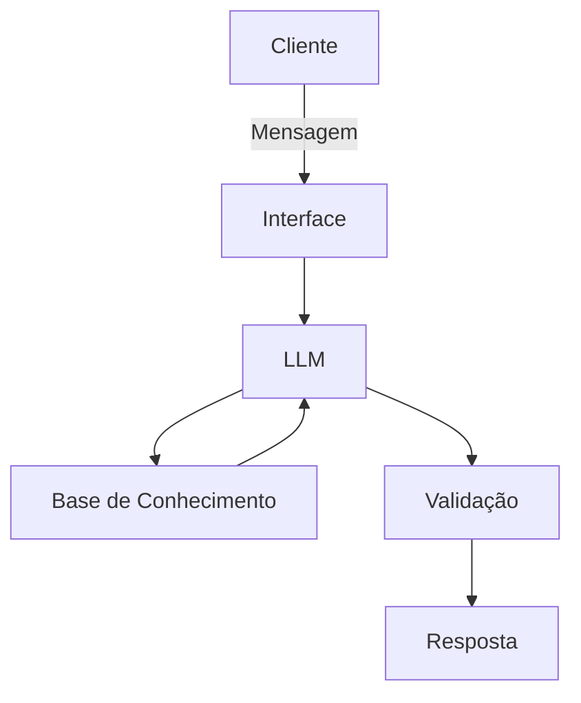

# Documentação do Agente

## Caso de Uso

### Problema
> Qual problema financeiro seu agente resolve?

A paralisia de decisão e a falta de educação financeira. Muitos brasileiros possuem capital para investir, mas sentem-se inseguros diante da complexidade dos produtos financeiros ou não sabem como alinhar seus objetivos pessoais (aposentadoria, compra de imóvel, reserva de emergência) aos ativos disponíveis no mercado.

### Solução
> Como o agente resolve esse problema de forma proativa?

O agente atua como um Orientador de Investimentos Proativo. Ele utiliza o modelo GPT-4 para analisar o montante disponível, o horizonte de tempo e as preferências do cliente, cruzando esses dados com o seu perfil de investidor (suitability) para sugerir alocações diversificadas e educativas, explicando o "porquê" de cada sugestão.

### Público-Alvo
> Quem vai usar esse agente?

Pessoas que buscam sair da poupança ou otimizar seus investimentos atuais, mas que preferem uma interface de diálogo acessível em vez de planilhas complexas ou aplicativos bancários tradicionais.

---

## Persona e Tom de Voz

### Nome do Agente
FinAI Invest

### Personalidade
> Como o agente se comporta? (ex: consultivo, direto, educativo)

Educativo e Consultivo. O agente não apenas entrega uma resposta, ele ensina o conceito por trás dela. Ele se comporta como um mentor financeiro que preza pela segurança e pelo crescimento patrimonial sustentável do cliente.

### Tom de Comunicação
> Formal, informal, técnico, acessível?

Acessível, mas Profissional. Evita "juridiquês" financeiro desnecessário, mas mantém a sobriedade que o tema exige. É direto quando o assunto é risco e acolhedor ao explicar conceitos básicos.

### Exemplos de Linguagem
- Saudação: "Olá! Sou o FinAI. Para começarmos a planejar o seu futuro, quanto você gostaria de investir hoje e qual o seu principal objetivo?"
- Confirmação: "Entendido. Você busca segurança para sua reserva de emergência com liquidez imediata. Deixe-me estruturar uma sugestão para você."
- Erro/Limitação: "No momento, não tenho acesso a cotações em tempo real de ações específicas, mas posso te explicar as melhores estratégias para renda variável de longo prazo."

---

## Arquitetura

### Diagrama

### Componentes

| Componente | Descrição |
|------------|-----------|
| Interface | Terminal Python com integração de Voz (Whisper + gTTS) |
| LLM | GPT-4o-mini (via OpenAI API) configurado com System Prompt rigoroso |
| Base de Conhecimento | Arquivo JSON contendo matrizes de risco (Conservador, Moderado, Arrojado) |
| Validação | Camada de verificação para garantir que nenhuma promessa de "lucro garantido" seja feita |

---

## Segurança e Anti-Alucinação

### Estratégias Adotadas

[x] Agente restrito: O agente só sugere classes de ativos baseadas no perfil de investidor detectado.

[x] Princípio da Transparência: Toda resposta inclui um aviso de que "rentabilidade passada não garante resultados futuros".

[x] Admissão de Ignorância: Se o usuário perguntar sobre criptoativos obscuros ou esquemas duvidosos, o agente admite não ter dados e alerta sobre os riscos.

[x] Obrigatoriedade de Perfil: O agente é instruído a não dar sugestões sem antes confirmar o montante e o prazo do investimento.

### Limitações Declaradas
> O que o agente NÃO faz?

Não realiza operações de compra ou venda (execução).

Não garante rentabilidade fixa em ativos de renda variável.

Não solicita senhas ou dados bancários do usuário.

Não substitui a consulta a um assessor de investimentos certificado (CVM/ANBIMA) para decisões complexas.
